## 1. 项目介绍
实现了Loop, Catmull-Clark, Doo-Sabin细分。并使用QT实现了GUI，实现了文件的读写功能，并使用QT openGL实现了网格的显示，并实现了鼠标控制网格的旋转和缩放。

## 2. 编程环境
Windows

VS 2019

## 3. 项目结构
│  HalfEdge.h	半边结构<br>
│  main.cpp <br>
│  MixMesh.cpp 	网格文件，包括Loop、Catmull-Clark， Doo-Sabin的实现<br>
│  MixMesh.h<br>
│  QtOpenGLWidget.cpp	 openGL窗口<br>
│  QtOpenGLWidget.h<br>
│  Quad.h 四边形<br>
│  REAL.h <br>
│  Subdivision.cpp 	主窗口，实现槽函数<br>
│  Subdivision.h<br>
│  Subdivision.ui 	qt ui文件<br>
│  Tri.h		三角形<br>
│  Vec3f.h	顶点<br>
│<br>
├─GLSL<br>
│      &nbsp;&nbsp;frag.glsl 片段着色器<br>
│      &nbsp;&nbsp;vert.glsl 顶点着色器<br>
│<br>
├─PaintStructure<br>
│      &nbsp;&nbsp;PaintQuad.h 用于绘制的四边形<br>
│      &nbsp;&nbsp;PaintTri.h  用于绘制的三角形<br>
│      &nbsp;&nbsp;PaintVec3f.h 用于绘制的顶点<br>
## 4. 数据结构
Catmull-Clark细分和Doo-Sabin细分可以处理任意的拓扑，这里我只是实现了Catmull-Clark对于四边形的处理。

```c++
四边形：
struct Quad
{
    unsigned int v[4];
    HalfEdge* halfedge;	// 半边结构
};

三角形：
struct Tri
{
    unsigned int v[3];
    HalfEdge* halfedge;
};

顶点：
struct Vec3f
{
    REAL x, y, z;
    HalfEdge* halfEdge;
}

半边：
struct HalfEdge
{
	unsigned int begin_id;		// 半边起始顶点序号
	unsigned int end_id;		// 半边指向的顶点序号
	HalfEdge* next;		// 在多边形中逆时针指向的下一条半边
	HalfEdge* oppo;		// 一条边中的对应半边
	int fid;	// 半边所属于的面的序号, -1表示在边界上
};

网格：
class MixMesh
{
public:
    std::vector<HalfEdge*> halfEdges_;	// 半边

    int num_vtx_{ 0 };	// 顶点的数量
    int num_tri_{ 0 };	// 三角形的数量
    int num_quad_{ 0 };	// 四边形的数量

    std::vector<Vec3f> vtxs_;	// 存储顶点
    std::vector<Tri> tris_;		// 存储三角形
    std::vector<Quad> quads_;	// 存储四边形

    QOpenGLBuffer vbo_, ebo_tri_, ebo_quad_;	// 顶点缓冲对象和索引缓冲对象
    QOpenGLShaderProgram shader_program_;	// 着色器

    REAL scale_factor_{ 1 };	// 缩放因子
    QVector3D translate_;	// 平移向量
};
```

## 5. 算法描述
### 5.1 Loop细分
Loop细分是Charles Loop在1987年在硕士论文中提出的一种对三角网格的细分算法。
Loop细分是递归定义的，每一个三角形一分为四，对于新生成的点和旧点以不同的规则更新。

点的更新规则：

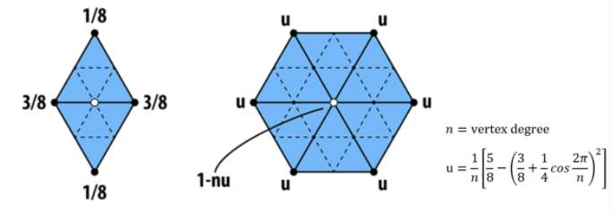
### 5.2 Catmull-Clark细分
Catmull-Clark细分是Edwin CatMull和Jin Clark在1978年提出的一种可以对任意拓扑的网格进行细分的一种算法，是递归定义的，在每一次递归中：
* 计算面点，是面的顶点的平均值
* 计算边点，是边的顶点和相邻的面点的平均值
* 计算旧的顶点,n是与点相邻的边数量， Q是相邻的面点的平均值，R是相邻的边点的平均值，v是本来的顶点
  
  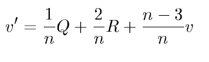
* 生成新的拓扑 
### 5.3 Doo-Sabin细分
Doo-Sabin细分是Dainel Doo和Malcolm Sabin在1978年提出的一种可以对任意拓扑的网格进行细分的一种算法，是递归定义的，在每一次递归中：
* 计算面的中心点和边的中心点，对于每一个点P，计算一个新的点P', 是点，相邻的边的中心点和面的中心点的平均值。

  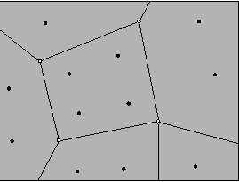

* 对于每一个面，连接面内的新点生成新的面
    
  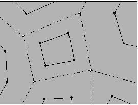

* 对于每一个点，连接点周围的新点生成新的面
  
  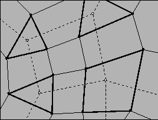
* 对于每一条边，连接边相邻的新点生成新的面
## 6. 结果
### 6.1 Loop细分
原始网格：

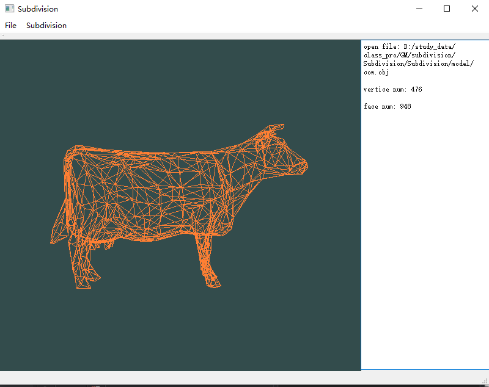

细分一次：

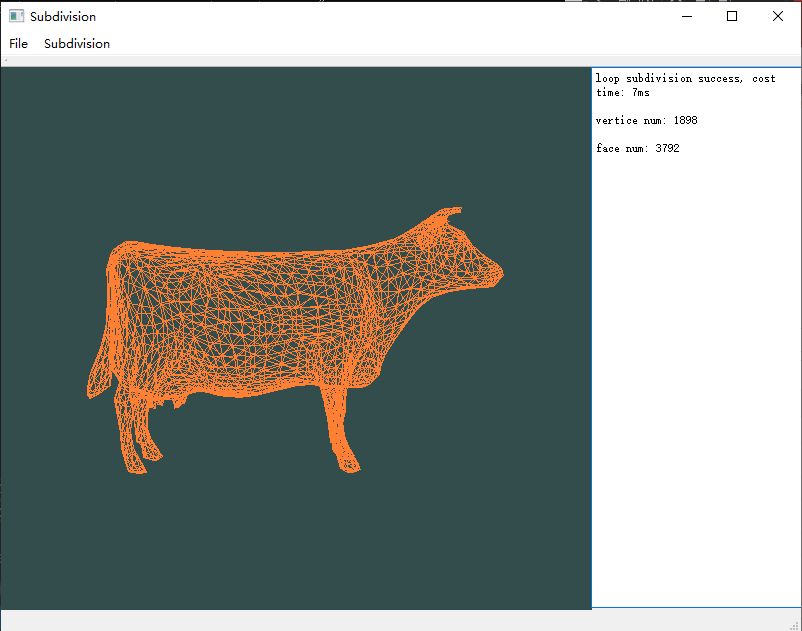

细分两次：

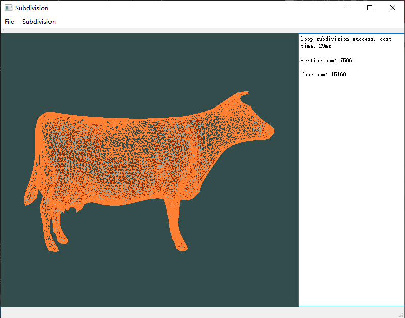

### 6.2 Catmull-Clark细分
原始网格：


细分一次：

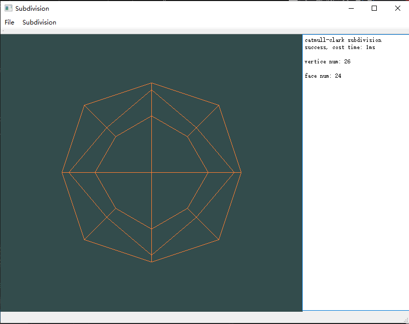

细分两次：

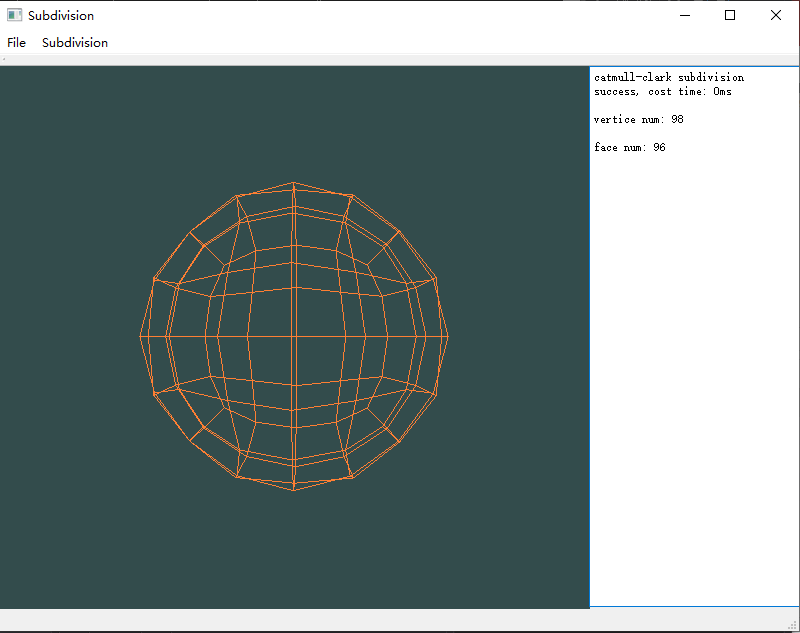

### 6.3 Doo-Sabin细分
原始网格：

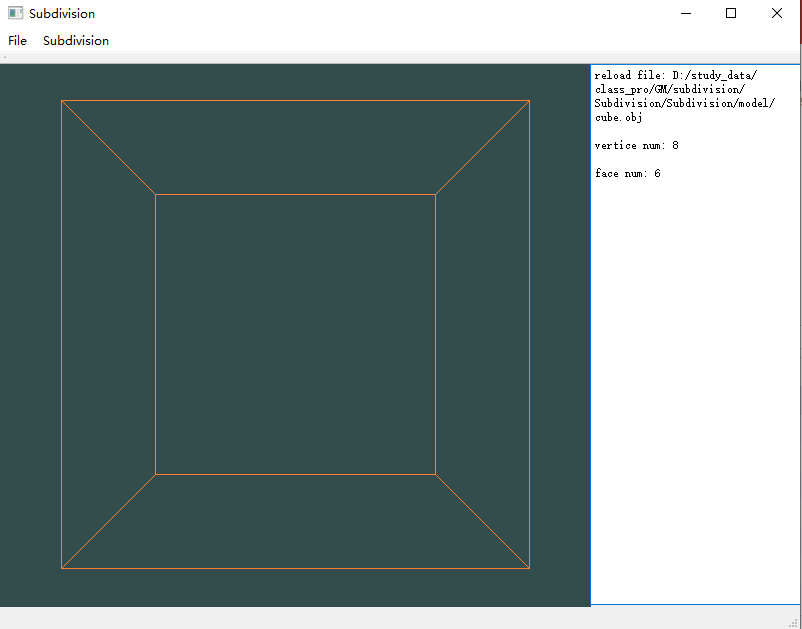

细分一次：

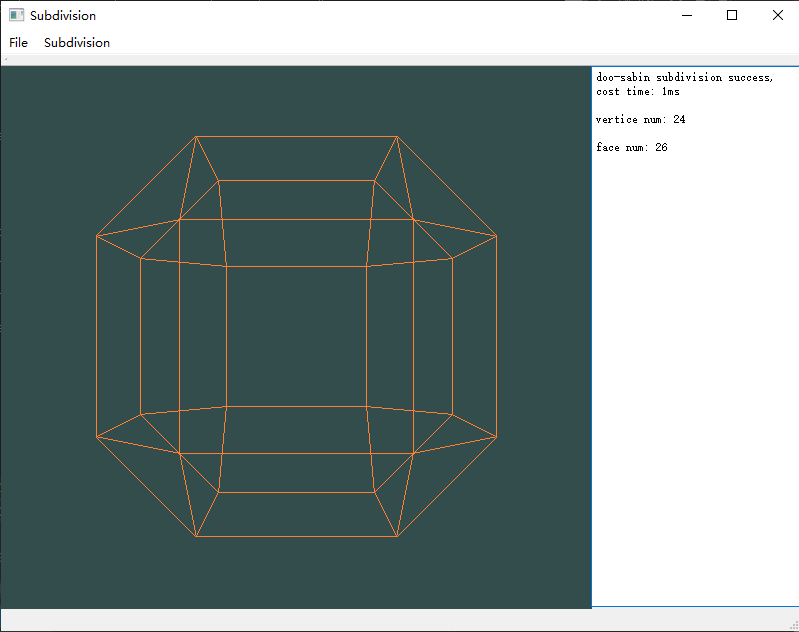

细分两次：

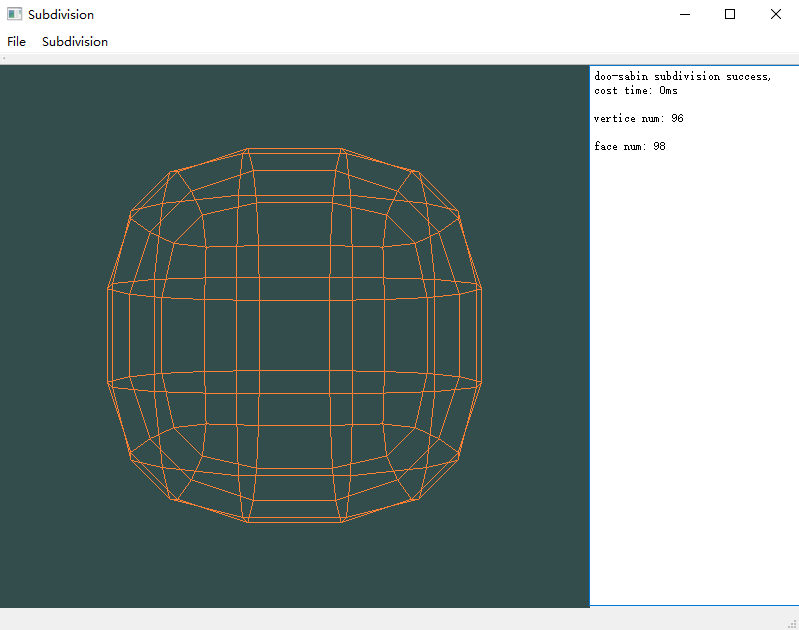

## 7. 参考
[1] loop曲面细分算法c++实现 https://blog.csdn.net/suian0424/article/details/86371383

[2] Doo-sabin曲面 http://graphics.cs.ucdavis.edu/education/CAGDNotes/Doo-Sabin/Doo-Sabin.html

[3] 细分曲面Catmull-Clark Subdivision算法 https://blog.csdn.net/tspatial_thunder/article/details/5938771